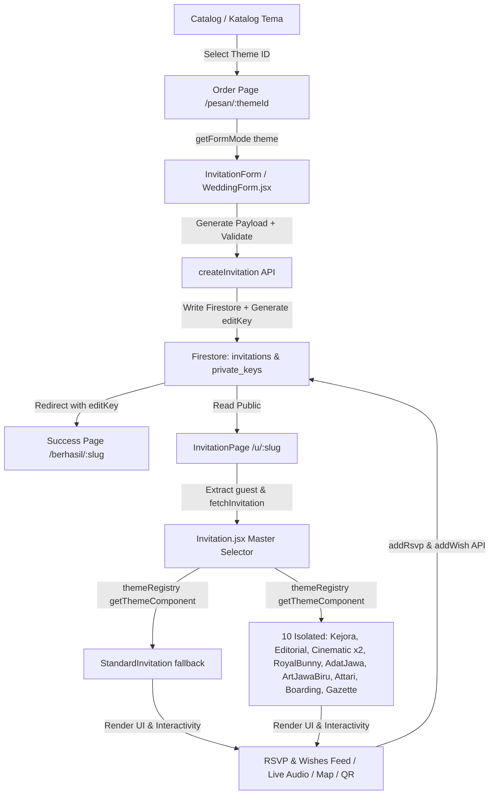
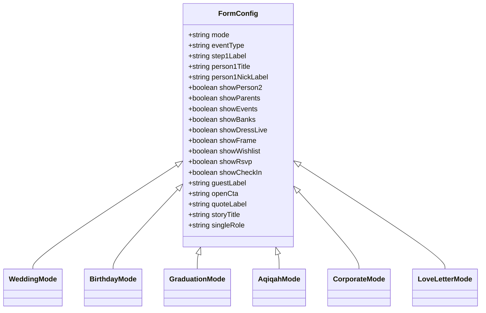
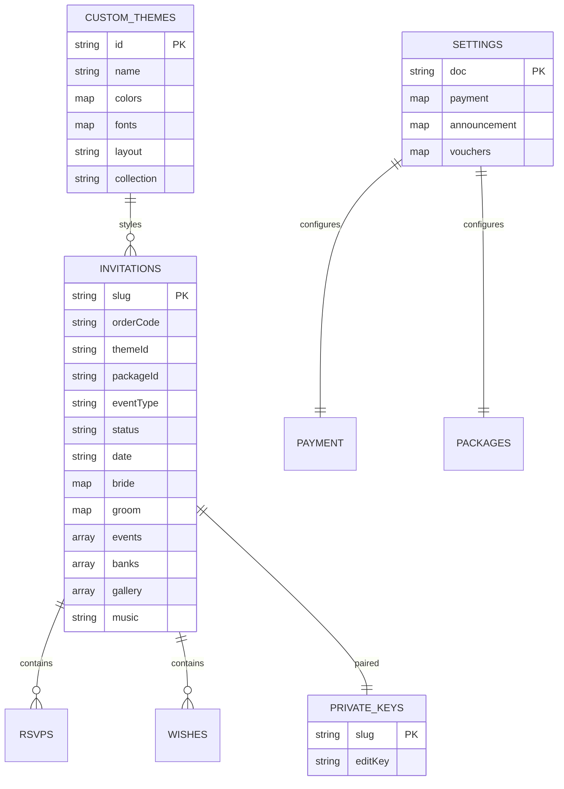

# 🏛️ ARUNA ARCHITECTURE CONTRACT & MASTER SYSTEM SPECIFICATION

> **Version:** 2.1.0 (Registry Dispatch & Serverless-Only Backend)
> **Target Audience:** AI Coding Assistants, Lead Developers, Theme Designers, Core Maintainers  
> **Status:** Locked & Standardized Contract  
> **Date:** 2026-09-01  

---

## 📑 TABLE OF CONTENTS
1. [Core Principles & Golden Rules](#1-core-principles--golden-rules)
2. [End-to-End Data Lifecycle Flow](#2-end-to-end-data-lifecycle-flow)
3. [Unified Data Model Contract](#3-unified-data-model-contract)
4. [Event Type System (`getFormMode`)](#4-event-type-system-getformmode)
5. [Component Contracts & Responsibilities](#5-component-contracts--responsibilities)
6. [Theme Architecture (Unified vs Isolated)](#6-theme-architecture-unified-vs-isolated)
7. [Theme Studio & Customization Engine](#7-theme-studio--customization-engine)
8. [Database & Storage Contract](#8-database--storage-contract)
9. [Security Boundaries & Anti-Tampering](#9-security-boundaries--anti-tampering)
10. [Breaking Change Matrix & Risk Map](#10-breaking-change-matrix--risk-map)
11. [Step-by-Step Extension Guides](#11-step-by-step-extension-guides)
12. [File Classification & Access Boundaries](#12-file-classification--access-boundaries)

---

## 1. CORE PRINCIPLES & GOLDEN RULES

To ensure that **new themes, event types, or visual features NEVER break the rest of the application**, every developer and AI agent MUST adhere to these non-negotiable principles:

1. **Strict Decoupling of Data, Logic, and Presentation:**
   - Themes only control visual styling, typography, animations, and structural aesthetics.
   - Themes **MUST NEVER** alter database schemas, manipulate payment statuses, or alter business calculation logic.
2. **Unified Data Schema Convention:**
   - Single-subject events (Birthday, Graduation, Aqiqah, Corporate, Love Letter) store their primary subject inside `bride` (or `bride.nick`, `bride.full`, `bride.photo`, `bride.parents`).
   - `groom` remains empty or disabled for single-subject events.
   - This ensures **100% database schema compatibility** across all 15+ themes without requiring database migrations.
3. **No Frontend-Only Security Boundary:**
   - All authorization (`editKey`, `adminKey`, status validation) is strictly enforced in Serverless API Handlers (`api/`) and Cloud Firestore Security Rules (`firestore.rules`).
4. **Isolated Theme Method for High-Complexity Layouts:**
   - Bespoke themes (e.g., *Art Jawa Biru, Boarding Pass, Royal Bunny, Wedding Gazette, Adat Jawa, Kejora*) reside in their own standalone files in `src/invitation/` with namespaced CSS classes to prevent global style leakage.
5. **Single Backend Path (Fase 1 refactor, 2026-08-31):**
   - Express server (`server/index.js`) SUDAH DIHAPUS. Satu-satunya jalur backend: serverless functions di `api/*.js` (Firebase Admin via `api/_firebase.js`).
   - `GET /u/:slug` → rewrite `vercel.json` → `api/og.js`: baca `invitations/{slug}`, inject OG tags (og:title, og:image, description, nama tamu dari `?to=`) ke `dist/index.html` — inilah yang membuat preview WhatsApp/Instagram bekerja.
   - Upload langsung client → Cloudinary (bukan lewat API). Kelima serverless lama (`verify-key`, `update-invitation`, `delete-invitation`, `add-domain`, `remove-domain`) + `admin-login` TERPAKAI klien via `src/lib/api.js`.
   - GOTCHA: jangan pernah import `firebase-admin`/`firebase/auth` modul berat lain di `api/*.js` di luar pola `api/_firebase.js` — crash saat bundling Vercel.

---

## 2. END-TO-END DATA LIFECYCLE FLOW



---

## 3. UNIFIED DATA MODEL CONTRACT

Every invitation document stored in Firestore `/invitations/{slug}` follows this exact contract:

| Field Path | Type | Nullable | Required | Purpose & Consumers |
|---|---|---|---|---|
| `slug` | `string` | No | Yes | Unique URL path (`/u/:slug`). Max 60 chars `[a-z0-9-_]`. |
| `orderCode` | `string` | No | Yes | Order identifier (`ARU-xxxx` or `ARxxxx`). |
| `themeId` | `string` | No | Yes | Registered theme identifier (e.g. `emas-senja`, `royal-bunny`). |
| `packageId` | `string` | No | Yes | Selected pricing tier (`gratis`, `hemat`, `lengkap`, `premium`). |
| `eventType` | `string` | No | Yes | `wedding` \| `birthday` \| `graduation` \| `aqiqah` \| `corporate` \| `love-letter`. |
| `status` | `string` | No | Yes | Payment status: `'unpaid'` \| `'paid'`. Managed by Admin only. |
| `date` | `string` | No | Yes | ISO Date `YYYY-MM-DD`. Primary countdown & event date. |
| `bride.nick` | `string` | No | Yes | Primary person nickname (or bride, birthday celebrant, graduate, baby name). |
| `bride.full` | `string` | Yes | No | Full legal name + academic degrees. |
| `bride.photo` | `string` | Yes | No | Cloudinary / local URL for portrait photo. |
| `bride.parents` | `string` | Yes | No | Lineage / parent information / organization board. |
| `bride.ig` | `string` | Yes | No | Instagram handle without `@`. |
| `groom.nick` | `string` | Yes | No | Second person nickname (Mempelai Pria). Empty for single-person events. |
| `groom.full` | `string` | Yes | No | Groom full legal name. |
| `groom.photo` | `string` | Yes | No | Groom portrait URL. |
| `groom.parents` | `string` | Yes | No | Groom parents info. |
| `groom.ig` | `string` | Yes | No | Groom Instagram handle. |
| `quote` | `string` | Yes | No | Scripture / Romantic quote / Graduation motto. |
| `quoteSource` | `string` | Yes | No | Source citation (e.g. *Q.S Ar-Rum: 21*). |
| `events` | `Array<Event>` | No | Yes | Array of event sessions (Akad, Resepsi, Party, Keynote). |
| `events[].title` | `string` | No | Yes | Session title. |
| `events[].date` | `string` | Yes | No | Event session date (defaults to main `date`). |
| `events[].time` | `string` | Yes | No | Time range string (e.g. `09:00 - 12:00 WIB`). |
| `events[].venue` | `string` | Yes | No | Building / Venue name. |
| `events[].address` | `string` | Yes | No | Physical address. |
| `events[].maps` | `string` | Yes | No | Google Maps URL. |
| `banks` | `Array<Bank>` | No | No | Amplop digital bank accounts. |
| `banks[].bank` | `string` | No | Yes | Bank / e-Wallet name (`BCA`, `Mandiri`, `GoPay`, `OVO`). |
| `banks[].name` | `string` | No | Yes | Account holder name. |
| `banks[].number` | `string` | No | Yes | Account / phone number. |
| `qris` | `string` | Yes | No | QRIS barcode image URL. |
| `story` | `Array<Story>`| No | No | Milestones / Kilas Balik / Journey. |
| `story[].year` | `string` | Yes | No | Year / Epoch string (e.g. `2024`). |
| `story[].title` | `string` | Yes | No | Milestone title. |
| `story[].body` | `string` | Yes | No | Narrative story text. |
| `story[].image` | `string` | Yes | No | Milestone photo URL. |
| `gallery` | `Array<string>`| No | No | Array of Cloudinary photo URLs. |
| `music` | `string` | Yes | No | Audio file URL (`.mp3`). |
| `rsvps` | `Array<Rsvp>` | No | No | Guest attendance confirmations (max 500 items). |
| `wishes` | `Array<Wish>` | No | No | Guest prayers and wishes with host replies (max 500 items). |
| `guests` | `Array<string>`| No | No | Whitelist/Broadcast guest names for URL generation. |
| `checkIns` | `Array<CheckIn>`| No | No | Real-time QR check-in records at the venue. |
| `customDomain` | `string` | Yes | No | Custom white-label domain name (e.g. `sarahbudi.com`). |

---

## 4. EVENT TYPE SYSTEM (`getFormMode`)

Event configurations are determined dynamically via `getFormMode(themeOrId, customThemes)` in `src/data/themes.js`:



### Event Mode Summary:
1. **`wedding`:** Full 2-person mode (Bride & Groom), parents, dual events (Akad & Resepsi), banks, wishlist, QR check-in.
2. **`birthday`:** 1-person mode (Name & Age), Party & Dinner events, banks, dream wishlist, dresscode, RSVP.
3. **`graduation`:** 1-person mode (Name & Academic Degree), Motto, Ceremony & Syukuran events, banks/gift, RSVP.
4. **`aqiqah`:** 1-person baby mode (Baby Name & Parents), Tasyakuran Doa, Cukur Rambut event, banks, NO wishlist, NO frame.
5. **`corporate`:** Organization/Host mode, Keynote & Gala events, VIP QR check-in, streaming, **NO banks, NO wishlist**.
6. **`love-letter`:** Intimate memory capsule, Love letter text, Journey milestones, Gallery & Music, **NO events, NO banks, NO wishlist**.

---

## 5. COMPONENT CONTRACTS & RESPONSIBILITIES

### Core Component Breakdown:

#### 1. `Invitation.jsx` (Master Invitation Controller)
- **Role:** Entry point for public URL `/u/:slug`. Dispatches via `themeRegistry`: `getThemeComponent(theme.layout) || getThemeComponent(theme.id) || getThemeComponent(data?.themeId)` → `StandardInvitation` fallback. JANGAN menambah if-chain tema baru.
- **Props Accepted:** `data` (Object), `guest` (String).
- **Sub-components:** `Cover`, `Hero`, `Greeting`, `Quote`, `Couple`, `Story`, `Countdown`, `Events`, `CheckIn`, `Live`, `DressCode`, `Gallery`, `Rsvp`, `Wishes`, `Gift`, `Closer`, `WeddingFrameModal`.
- **Side Effects:** AutoPlay background audio on first user touch (`onOpen`), visitor counter increment (`recordInvitationView`).

#### 2. `InvitationForm` (`src/components/WeddingForm.jsx`)
- **Role:** Adaptive 4-step wizard form for ordering and editing invitations.
- **Steps:** 
  1. *Pengantin / Tokoh Utama* (Dynamic fields via `getFormMode`).
  2. *Acara* (Skipped if `showEvents: false`).
  3. *Pelengkap / Surat & Kenangan* (Quote, Story, Gallery, Banks, QRIS, Music, Live, Dresscode).
  4. *Bayar / Pemesan* (Package selection via `getPackagesByEventType`, voucher, submit).

#### 3. `PrintCardModal.jsx` & `LoveQRCardGenerator.jsx`
- **Role:** Client-side high-resolution Canvas generator for physical souvenir cards, table number cards, and QR cards.
- **Contract:** Must check `isSingle` to avoid printing `& Groom` on single-subject invitations.

#### 4. `WeddingFrameModal.jsx`
- **Role:** Client-side Canvas generator for 1:1 and 9:16 Instagram Story photobooth frames.
- **Contract:** Frame header text dynamically adapts to event type (`SPECIAL BIRTHDAY`, `ACADEMIC HONORS`, `THE WEDDING OF`).

---

## 6. THEME ARCHITECTURE: UNIFIED VS ISOLATED

Themes in ByAruna are structured in two tiers, dispatched via **`src/invitation/themeRegistry.js`**:

### Registry Dispatch (Fase 2 refactor — WAJIB dibaca)
- `src/invitation/Invitation.jsx` TIDAK lagi berisi if-berantai. Dispatch: `getThemeComponent(theme.layout) || getThemeComponent(theme.id) || getThemeComponent(data?.themeId)` → `StandardInvitation` sebagai fallback.
- Komponen terisolasi didaftarkan via `registerThemeComponent(layout, component)` di bagian atas `Invitation.jsx` (11 entri, termasuk alias legacy `jawa-biru`).
- **Menambah tema terisolasi baru = 3 langkah:** (1) entri di `src/data/themes.js`, (2) komponen `src/invitation/Theme<Nama>.jsx` + CSS ber-prefix, (3) satu baris `registerThemeComponent(...)`.

### Tier 1: Unified Standard Layouts (`layout` ∈ `classic | modern | garden | noir | islamic | batik | editorial | memory-capsule`)
- Dikelola `StandardInvitation` di `src/invitation/Invitation.jsx` (satu komponen, CSS vars).
- Konfigurasi form/fitur dari DATA: `getFormMode()` = `FORM_BASES[eventType]` + `theme.formOverrides`; `getThemeFeatures()` = `DEFAULT_FEATURES` + `FEATURE_SETS[layout]` + `theme.features`. **Jangan menambah if per tema** — tambahkan `formOverrides`/`features` di entri tema.
- Safe to customize via Theme Studio.

### Tier 2: Isolated Bespoke Layouts (`kejora | modern-editorial-letter | cinematic-love-letter | cinematic-minimal | royal-bunny | adat-jawa | art-jawa-biru | attari | boarding | wedding-gazette`)
- Self-contained di `src/invitation/Theme<Nama>.jsx` + CSS (semua tema, termasuk yang dulu di `src/themes/`, kini SATU folder: `src/invitation/`).
- `themeRegistry.js` + `themeContract.js` juga tinggal di `src/invitation/`.
- **Isolation Rule:** CSS classes wajib ber-prefix theme (`.kj-`, `.rb-`, `.jb-`, `.jw-`, `.gz-`, dll) untuk mencegah kontaminasi lintas tema.

---

## 7. THEME STUDIO & CUSTOMIZATION ENGINE

`src/pages/ThemeStudio.jsx` allows users and admins to create new themes without touching source code:

| Customization Group | Variables Supported | Persistence Location |
|---|---|---|
| **Colors** | `bg`, `paper`, `fg`, `muted`, `accent`, `accentSoft`, `cover` | Firestore `/custom_themes/{id}` |
| **Typography** | `fonts.display`, `fonts.script`, `fonts.body` | Firestore `/custom_themes/{id}` |
| **Atmosphere** | `particleEffect` (`gold-dust`, `sakura-petals`, `sparkles`, `floating-hearts`) | Firestore `/custom_themes/{id}` |
| **Assets** | Custom cover URL, music URL, frame decoration | Firestore `/custom_themes/{id}` |

---

## 8. DATABASE & STORAGE CONTRACT



---

## 9. SECURITY BOUNDARIES & PROTECTED AREAS

### 🔒 PROTECTED ARCHITECTURE (DO NOT BYPASS):

1. **Private Keys Brankas (`/private_keys/{slug}`):**
   - Public read is **BLOCKED** (`allow read: if request.auth != null;`).
   - Verification of `editKey` MUST take place inside Serverless API (`api/verify-key.js` or `api/update-invitation.js`).
2. **Payment Status Anti-Tampering:**
   - Clients using `editKey` are forbidden from writing `status: 'paid'`.
   - Status transitions to `paid` can ONLY be executed by an authenticated admin in `api/update-invitation.js` or `setInvitationStatus`.
3. **URL Protocol Sanitization:**
   - Any external anchor tag (`href`) MUST pass through `safeUrl()` in `src/lib/utils.js` to block `javascript:` pseudo-protocol attacks.
4. **Input Length Limits & Anti-DoS:**
   - `addRsvp` and `addWish` enforce a maximum of 100 characters for names, 500 characters for messages, and cap arrays at 500 items per document.

---

## 10. BREAKING CHANGE MATRIX & RISK MAP

| If You Modify... | What Will Break? | Mitigation / Safe Protocol |
|---|---|---|
| `bride` / `groom` object keys | All invitation templates (10 isolated + unified), RSVP matching, PDF/Canvas generators | Always preserve `.nick`, `.full`, `.photo`, `.parents`, `.ig`. Use optional chaining `?.`. |
| `events` array structure | Countdown timer, Calendar generator, Event session list | Maintain `{ title, date, time, venue, address, maps }`. |
| `theme.layout` enum | Router selector in `Invitation.jsx` and `App.jsx` | When adding a new layout, register it via `registerThemeComponent()` (isolated) or via `formOverrides`/`features` di entri tema (unified). Jangan menambah if-chain. |
| `getPackagesByEventType()` in `src/data/site.js` | Form Step 4 (Bayar), Success Page price calculation, Admin kwitansi | Always provide fallback to `packages[0]`. |
| `firestore.rules` | Client RSVP submissions, Testimonials, Theme Studio save | Always test rules with Firebase Emulator or verify public create permissions for unpaid invitations. |
| `api/og.js` (OG injection untuk `/u/:slug`) | Preview link WhatsApp/Instagram tamu | Jangan hapus rewrite `/u/:slug*` di `vercel.json`; uji `curl -s <url>/u/<slug> | grep og:` setelah deploy. |
| `api/admin-login.js` | Login admin & ganti password | Jalur tunggal server-side auth klien; jangan pindahkan ke client SDK. |

---

## 11. STEP-BY-STEP EXTENSION GUIDES

### 🎨 How to Create a New Theme (Isolated Method)
1. **Register Theme in `src/data/themes.js`:**
   ```javascript
   {
     id: 'emerald-luxury',
     name: 'Emerald Luxury Keraton',
     tag: 'Premium',
     layout: 'emerald-luxury',
     collection: 'premium',
     cover: '/themes/emerald-cover.jpg',
     opener: 'THE WEDDING OF',
     // OPSIONAL: field form beda dari base eventType-nya
     formOverrides: { openCta: 'GAS KANAN' },
   }
   ```
2. **Create Template Component `src/invitation/ThemeEmeraldLuxury.jsx`:**
   - Import namespaced CSS `./ThemeEmeraldLuxury.css`.
   - Accept `{ data, guest, preview, theme }`.
   - Integrate `addRsvp` and `addWish` from `../lib/api`.
   - Use `safeUrl` for external links.
3. **Register in the registry (top of `src/invitation/Invitation.jsx`):**
   ```jsx
   registerThemeComponent('emerald-luxury', ThemeEmeraldLuxury)
   ```
   JANGAN menambah `if (theme.layout === ...)` baru — dispatch sudah lewat `themeRegistry.js`.

### 🎈 How to Create a New Event Type (e.g. Khitanan / Engagement)
1. **Add a base mode in `src/data/themes.js`:**
   Tambahkan kunci baru di `FORM_BASES` (field visibility, labels, placeholders, default event sessions) — `getFormMode()` otomatis memakainya untuk `eventType` tersebut. JANGAN menambah `if (eventType === ...)` baru.
2. **Update `eventPackages` in `src/data/site.js`:**
   Define tier packages and pricing for the new event type.
3. **Update `document.title` and WhatsApp helpers:**
   Add the new eventType case in `InvitationPage.jsx`, `CustomDomainPage.jsx`, and `Manage.jsx`.

---

## 12. FILE CLASSIFICATION & ACCESS BOUNDARIES

```
├── 🔒 CRITICAL & PROTECTED (Do NOT modify without architectural approval)
│   ├── api/_firebase.js
│   ├── api/og.js
│   ├── api/admin-login.js
│   ├── api/update-invitation.js
│   ├── api/delete-invitation.js
│   ├── api/verify-key.js
│   ├── vercel.json (rewrites /u/:slug* → api/og)
│   ├── firestore.rules
│   └── src/context/AuthContext.jsx
│
├── ⚙️ CORE CONTRACTS & BUSINESS LOGIC (High Risk)
│   ├── src/data/themes.js
│   ├── src/data/site.js
│   ├── src/lib/api.js
│   └── src/lib/utils.js
│
├── 🎨 PRESENTATIONAL & THEMES (Safe for Visual Iteration)
│   ├── src/invitation/Theme*.jsx
│   ├── src/invitation/Theme*.css
│   ├── src/invitation/Invitation.jsx
│   └── src/components/AtmosphereParticles.jsx
│
└── 📄 APPLICATION PAGES & WIZARDS
    ├── src/App.jsx (Lazy Route Master)
    ├── src/pages/Order.jsx
    ├── src/pages/Edit.jsx
    ├── src/pages/Manage.jsx
    └── src/pages/ThemeStudio.jsx
```
